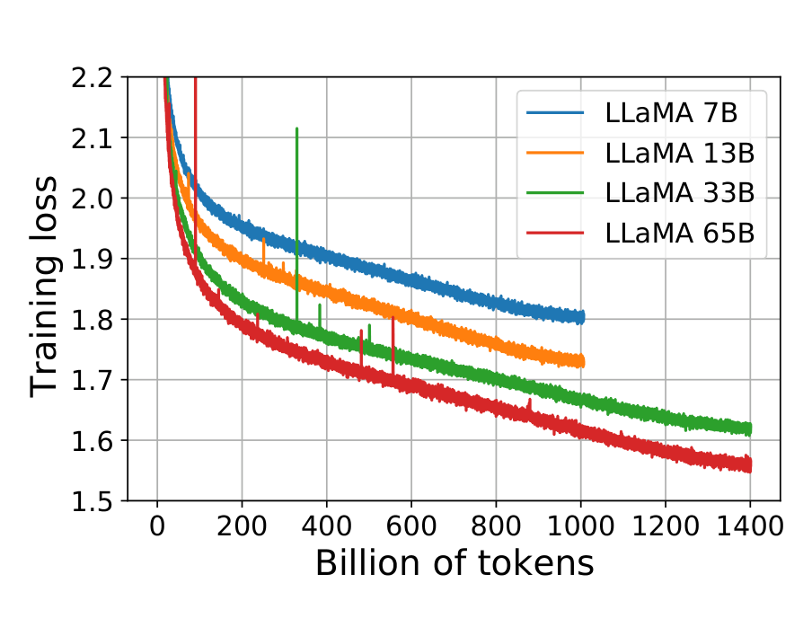
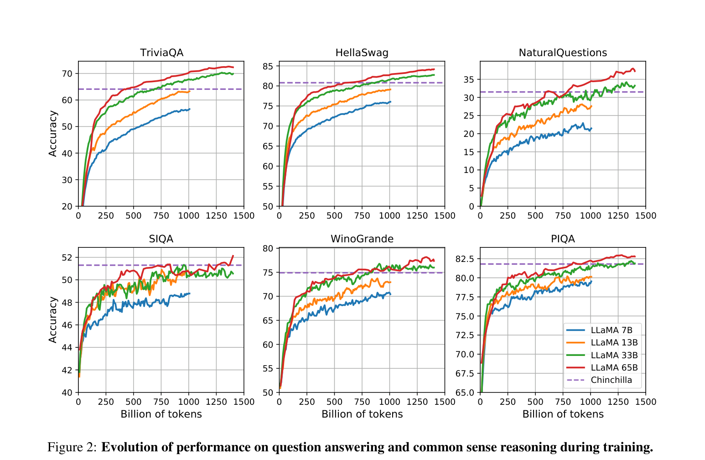
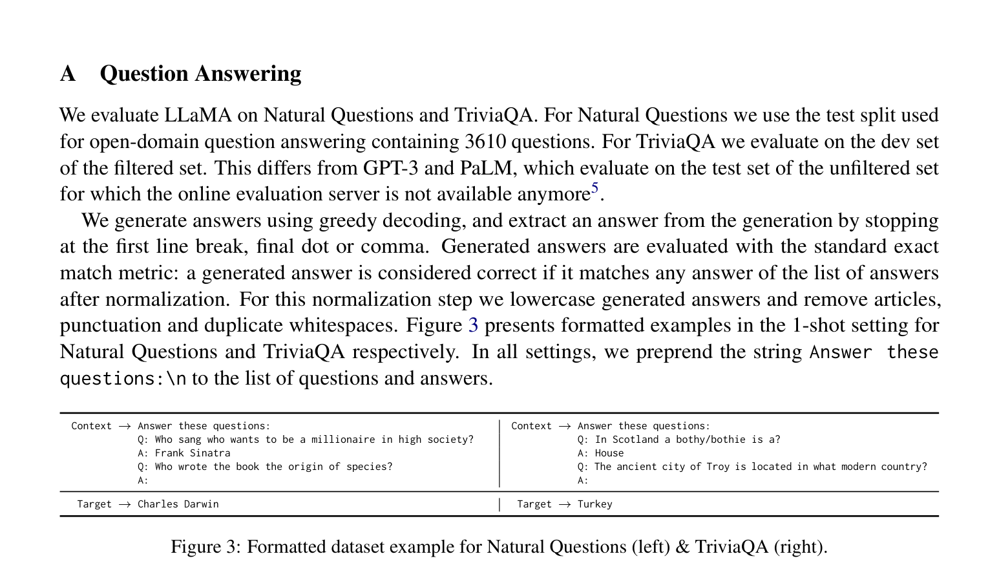

# LLaMA 论文精读笔记

> 原文标题：**LLaMA: Open and Efficient Foundation Language Models**（开放且高效的基础语言模型）
> 作者机构：Meta AI（Hugo Touvron、Guillaume Lample 等）
> 发表时间：2023 年 2 月 27 日（arXiv v1）

这是一份对 LLaMA 论文的中文精读笔记。为便于查阅，专有名词在正文首次出现时保留英文，文末附有完整的**中英文术语对照附录**；论文中的三张配图（Figure 1–3）也全部嵌入本笔记。

---

## 目录

1. [摘要与核心贡献](#一摘要与核心贡献)
2. [引言：为什么要做 LLaMA](#二引言为什么要做-llama)
3. [方法（Approach）](#三方法approach)
4. [主要实验结果（Main Results）](#四主要实验结果main-results)
5. [指令微调（Instruction Finetuning）](#五指令微调instruction-finetuning)
6. [偏见、毒性与虚假信息](#六偏见毒性与虚假信息)
7. [碳足迹（Carbon Footprint）](#七碳足迹carbon-footprint)
8. [结论](#八结论)
9. [全部图表索引](#九全部图表索引)
10. [附录 A：中英文术语对照表](#附录-a中英文术语对照表)
11. [附录 B：论文原文链接](#附录-b论文原文链接)

---

## 一、摘要与核心贡献

- **模型定位**：LLaMA 是一组**基础语言模型（Foundation Language Model）**，参数规模从 **7B 到 65B**。
- **训练数据**：在**数万亿（trillions）个 token** 上训练，且**只使用公开可获取（publicly available）的数据集**，不依赖任何私有、不可获取的数据。
- **性能亮点**：
  - **LLaMA-13B 在大多数基准上超越 GPT-3（175B）**，参数量却小了 10 倍以上，可在单张 GPU 上运行。
  - **LLaMA-65B 与业界最佳模型 Chinchilla-70B、PaLM-540B 相当**。
- **核心贡献**：
  1. 证明了**仅凭公开数据**也能训练出 SOTA（state-of-the-art）级别的大模型；
  2. 将全部模型开源，推动大模型研究的**民主化（democratize）**。

---

## 二、引言：为什么要做 LLaMA

### 2.1 Scaling Laws（缩放定律）之争

- 早期观点（Kaplan et al., 2020）：**参数越多，性能越好**，于是业界不断把模型做大。
- Chinchilla（Hoffmann et al., 2022）修正：在**给定训练算力预算（compute budget）**下，最佳性能并非由最大模型取得，而是由**参数更小、但训练数据更多**的模型取得。

### 2.2 核心动机：训练成本 vs 推理成本（Inference Budget）

- **Chinchilla 的盲点**：它只优化训练算力，**忽略了推理预算**——而当模型要大规模部署对外服务时，推理成本才是关键。
- **LLaMA 的哲学**：在给定目标性能时，首选的不是「训练最快」的模型，而是「**推理最快**」的模型。虽然把一个小模型训练更久前期更贵，但它在推理阶段会**长期更便宜**。
- **关键实证**：Chinchilla 建议「10B 模型训练 200B tokens」，而 LLaMA 团队发现 **7B 模型在训练超过 1T tokens 后性能仍在持续提升**。
- **目标**：用**远超常规的 token 量**去训练，打造在**不同推理预算下都最优**的模型系列。

---

## 三、方法（Approach）

### 3.1 预训练数据（Pre-training Data）

整体训练数据约 **1.4T tokens**，全部来源于公开渠道，混合比例见 **Table 1**：

| 数据源 | 采样占比 | Epochs | 磁盘大小 |
| :--- | :---: | :---: | :---: |
| English CommonCrawl | 67.0% | 1.10 | 3.3 TB |
| C4 | 15.0% | 1.06 | 783 GB |
| Github | 4.5% | 0.64 | 328 GB |
| Wikipedia | 4.5% | 2.45 | 83 GB |
| Gutenberg + Books3 | 4.5% | 2.23 | 85 GB |
| ArXiv | 2.5% | 1.06 | 92 GB |
| Stack Exchange | 2.0% | 1.03 | 78 GB |

各数据源的处理要点：

- **English CommonCrawl（67%）**：用 **CCNet** 管道处理 2017–2020 五份 dump，行级去重、fastText 语言识别过滤非英文页、n-gram 语言模型过滤低质内容，并训练线性分类器丢弃「非 Wikipedia 引用级别」的页面。
- **C4（15%）**：同样去重与语言识别，但质量过滤主要依赖启发式规则（标点、词/句数量等）。
- **Github（4.5%）**：仅保留 Apache / BSD / MIT 协议项目，基于行长与字母数字比例过滤，正则去除 boilerplate（页眉等模板文本），文件级精确去重。
- **Wikipedia（4.5%）**：2022 年 6–8 月 dump，覆盖 20 种拉丁/西里尔字母语言，去除超链接与格式。
- **Gutenberg + Books3（4.5%）**：书籍级去重（内容重叠 >90% 的书被删）。
- **ArXiv（2.5%）**：删除首个章节前的内容与参考文献、去注释、内联展开用户宏定义。
- **Stack Exchange（2%）**：保留 28 个最大站点，去 HTML，答案按得分从高到低排序。

> 注：除 Wikipedia 与 Books 约训练 2 个 epoch 外，其余数据基本只训练 1 次。

**Tokenizer（分词器）**：用 **SentencePiece** 实现 **BPE（Byte-Pair Encoding，字节对编码）**。两个关键细节：
1. 把**所有数字拆分为单个数字**；
2. 对未知的 UTF-8 字符**回退到字节（fallback to bytes）**进行分解。

### 3.2 模型架构（Architecture）

基于 Transformer，在原始架构上引入了三项改进（括号内为灵感来源）：

1. **Pre-normalization / 前置归一化 [GPT-3]**：为提升训练稳定性，对每个 Transformer 子层的**输入**（而非输出）做归一化，并使用 **RMSNorm（Root Mean Square Layer Normalization）** 函数（Zhang & Sennrich, 2019）。
2. **SwiGLU 激活函数 [PaLM]**：用 SwiGLU 替代 ReLU 以提升性能（Shazeer, 2020），维度取 **⅔ × 4d**（而非 PaLM 的 4d）。
3. **Rotary Embeddings / 旋转位置编码 [GPTNeo]**：移除绝对位置编码，改在**每一层**加入 **RoPE（Rotary Positional Embeddings）**（Su et al., 2021）。

### 3.3 优化器（Optimizer）

- 优化器：**AdamW**，$\beta_1 = 0.9$，$\beta_2 = 0.95$。
- 学习率调度：**Cosine schedule**，最终学习率降至峰值的 **10%**。
- 其他超参：**weight decay = 0.1**，**gradient clipping = 1.0**，**warmup = 2,000 steps**。

### 3.4 模型规模与超参（Table 2）

| params | dimension | n heads | n layers | learning rate | batch size | n tokens |
| :---: | :---: | :---: | :---: | :---: | :---: | :---: |
| 6.7B | 4096 | 32 | 32 | 3.0e-4 | 4M | 1.0T |
| 13.0B | 5120 | 40 | 40 | 3.0e-4 | 4M | 1.0T |
| 32.5B | 6656 | 52 | 60 | 1.5e-4 | 4M | 1.4T |
| 65.2B | 8192 | 64 | 80 | 1.5e-4 | 4M | 1.4T |

**Figure 1：训练过程中的 Training Loss（随训练 token 数下降）**

> 图释：7B / 13B / 33B / 65B 四个模型的训练损失曲线。33B 与 65B 训练了 1.4T tokens，两个较小模型训练了 1.0T tokens，所有模型 batch size 均为 4M tokens。曲线显示模型越大，损失越低，且损失始终稳步下降（未饱和）。

### 3.5 高效实现（Efficient Implementation）

- **Causal Multi-head Attention（因果多头注意力）**：使用 **xformers** 库实现，**不存储 attention weights**，也**不计算被 causal mask 掩盖的 key/query 分数**，大幅降低显存与运行时间。
- **Activation Checkpointing（激活值检查点）**：手动实现 Transformer 层的 backward 函数（不依赖 PyTorch autograd），**保存计算代价高的激活值**（如线性层输出），减少反向传播时的重计算。
- **并行策略**：采用**模型并行（model parallelism）与序列并行（sequence parallelism）**（Korthikanti et al., 2022），并尽量让激活计算与 GPU 间 all_reduce 通信**重叠**。
- **训练吞吐与时间**：训练 65B 模型时，在 **2048 张 A100 80GB GPU** 上约 **380 tokens/sec/GPU**；训练 1.4T tokens 约需 **21 天**。

---

## 四、主要实验结果（Main Results）

评估覆盖 **zero-shot 与 few-shot**，共 **20 个基准**。

### 4.1 常识推理（Common Sense Reasoning，Table 3，Zero-shot）

八个基准：BoolQ、PIQA、SIQA、HellaSwag、WinoGrande、ARC-e、ARC-c、OBQA。

| 模型 | BoolQ | PIQA | SIQA | HellaSwag | WinoGrande | ARC-e | ARC-c | OBQA |
| :--- | :---: | :---: | :---: | :---: | :---: | :---: | :---: | :---: |
| GPT-3 175B | 60.5 | 81.0 | - | 78.9 | 70.2 | 68.8 | 51.4 | 57.6 |
| Gopher 280B | 79.3 | 81.8 | 50.6 | 79.2 | 70.1 | - | - | - |
| Chinchilla 70B | 83.7 | 81.8 | 51.3 | 80.8 | 74.9 | - | - | - |
| PaLM 540B | 88.0 | 82.3 | - | 83.4 | 81.1 | 76.6 | 53.0 | 53.4 |
| **LLaMA 7B** | 76.5 | 79.8 | 48.9 | 76.1 | 70.1 | 72.8 | 47.6 | 57.2 |
| **LLaMA 13B** | 78.1 | 80.1 | 50.4 | 79.2 | 73.0 | 74.8 | 52.7 | 56.4 |
| **LLaMA 33B** | 83.1 | 82.3 | 50.4 | 82.8 | 76.0 | 80.0 | 57.8 | 58.6 |
| **LLaMA 65B** | 85.3 | 82.8 | 52.3 | 84.2 | 77.0 | 78.9 | 56.0 | 60.2 |

**结论**：LLaMA-65B 在除 BoolQ 外的所有基准上超越 Chinchilla-70B；在除 BoolQ 与 WinoGrande 外超越 PaLM-540B。**LLaMA-13B 在多数基准上超越 GPT-3 175B**。

### 4.2 闭卷问答（Closed-book QA）

**NaturalQuestions（Table 4，exact match）**

| 模型 | 0-shot | 1-shot | 5-shot | 64-shot |
| :--- | :---: | :---: | :---: | :---: |
| GPT-3 175B | 14.6 | 23.0 | - | 29.9 |
| Gopher 280B | 10.1 | - | 24.5 | 28.2 |
| Chinchilla 70B | 16.6 | - | 31.5 | 35.5 |
| PaLM 540B | 21.2 | 29.3 | - | 39.6 |
| **LLaMA 7B** | 16.8 | 18.7 | 22.0 | 26.1 |
| **LLaMA 13B** | 20.1 | 23.4 | 28.1 | 31.9 |
| **LLaMA 33B** | 24.9 | 28.3 | 32.9 | 36.0 |
| **LLaMA 65B** | 23.8 | 31.0 | 35.0 | 39.9 |

**TriviaQA（Table 5，filtered dev set）**

| 模型 | 0-shot | 1-shot | 5-shot | 64-shot |
| :--- | :---: | :---: | :---: | :---: |
| Gopher 280B | 43.5 | - | 57.0 | 57.2 |
| Chinchilla 70B | 55.4 | - | 64.1 | 64.6 |
| **LLaMA 7B** | 50.0 | 53.4 | 56.3 | 57.6 |
| **LLaMA 13B** | 56.6 | 60.5 | 63.1 | 64.0 |
| **LLaMA 33B** | 65.1 | 67.9 | 69.9 | 70.4 |
| **LLaMA 65B** | 68.2 | 71.6 | 72.6 | 73.0 |

**结论**：LLaMA-65B 在 zero-shot 与 few-shot 下均达到 SOTA；LLaMA-13B 仅为其 1/5–1/10 大小却仍具竞争力，且推理时可跑在单张 V100 GPU 上。

### 4.3 阅读理解（Reading Comprehension，Table 6，RACE，Zero-shot）

| 模型 | RACE-middle | RACE-high |
| :--- | :---: | :---: |
| GPT-3 175B | 58.4 | 45.5 |
| PaLM 540B | 68.1 | 49.1 |
| **LLaMA 7B** | 61.1 | 46.9 |
| **LLaMA 13B** | 61.6 | 47.2 |
| **LLaMA 33B** | 64.1 | 48.3 |
| **LLaMA 65B** | 67.9 | 51.6 |

**结论**：LLaMA-65B 与 PaLM-540B 势均力敌；LLaMA-13B 超越 GPT-3 数个百分点。

### 4.4 数学推理（Mathematical Reasoning，Table 7）

数据集：MATH、GSM8k；maj1@k 表示对每题采样 k 个答案后**多数投票（majority voting）**（MATH 用 k=256，GSM8k 用 k=100）。

| 模型 | MATH | +maj1@k | GSM8k | +maj1@k |
| :--- | :---: | :---: | :---: | :---: |
| PaLM 540B | 8.8 | - | 56.5 | - |
| Minerva 62B | 27.6 | 43.4 | 52.4 | 68.5 |
| Minerva 540B | 33.6 | 50.3 | 68.5 | 78.5 |
| **LLaMA 7B** | 2.9 | 6.9 | 11.0 | 18.1 |
| **LLaMA 13B** | 3.9 | 8.8 | 17.8 | 29.3 |
| **LLaMA 33B** | 7.1 | 15.2 | 35.6 | 53.1 |
| **LLaMA 65B** | 10.6 | 20.5 | 50.9 | **69.7** |

**结论**：LLaMA-65B 在 GSM8k 上达 **69.7%**，**超越了专门在数学数据上微调过的 Minerva-62B（68.5%）**——而 LLaMA 并未在数学数据上做过微调。

### 4.5 代码生成（Code Generation，Table 8）

| 模型 | Params | HumanEval pass@1 | pass@100 | MBPP pass@1 | pass@80 |
| :--- | :---: | :---: | :---: | :---: | :---: |
| LaMDA | 137B | 14.0 | 47.3 | 14.8 | 62.4 |
| PaLM | 62B | 15.9 | 46.3 | 21.4 | 63.2 |
| PaLM | 540B | 26.2 | 76.2 | 36.8 | 75.0 |
| **LLaMA 7B** | 7B | 10.5 | 36.5 | 17.7 | 56.2 |
| **LLaMA 13B** | 13B | 15.8 | 52.5 | 22.0 | 64.0 |
| **LLaMA 33B** | 33B | 21.7 | 70.7 | 30.2 | 73.4 |
| **LLaMA 65B** | 65B | 23.7 | 79.3 | 37.7 | 76.8 |

**结论**：在相近参数量下，LLaMA 超越同为通用模型的 LaMDA 与 PaLM；**LLaMA-13B 及以上在 HumanEval 与 MBPP 上均超越 LaMDA-137B**；LLaMA-65B 超越 PaLM-62B。pass@1 用温度 0.1 采样，pass@100/@80 用温度 0.8。

### 4.6 大规模多任务语言理解（MMLU，Table 9，5-shot）

| 模型 | Humanities | STEM | Social Sci. | Other | Average |
| :--- | :---: | :---: | :---: | :---: | :---: |
| GPT-3 175B | 40.8 | 36.7 | 50.4 | 48.8 | 43.9 |
| Gopher 280B | 56.2 | 47.4 | 71.9 | 66.1 | 60.0 |
| Chinchilla 70B | 63.6 | 54.9 | 79.3 | 73.9 | 67.5 |
| PaLM 540B | 77.0 | 55.6 | 81.0 | 69.6 | 69.3 |
| **LLaMA 7B** | 34.0 | 30.5 | 38.3 | 38.1 | 35.1 |
| **LLaMA 13B** | 45.0 | 35.8 | 53.8 | 53.3 | 46.9 |
| **LLaMA 33B** | 55.8 | 46.0 | 66.7 | 63.4 | 57.8 |
| **LLaMA 65B** | 61.8 | 51.7 | 72.9 | 67.4 | **63.4** |

**结论**：LLaMA-65B 平均 **63.4%**，略落后于 Chinchilla-70B（67.5%）与 PaLM-540B（69.3%）。**原因分析**：LLaMA 预训练中书籍与论文（ArXiv + Gutenberg + Books3）仅 **177GB**，而竞品模型用了高达 **2TB** 的书籍数据。

### 4.7 训练过程中的性能演变

**Figure 2：训练过程中在问答与常识推理上的性能演变**

> 图释：六个子图分别展示 TriviaQA、HellaSwag、NaturalQuestions、SIQA、WinoGrande、PIQA 随训练 token 数的准确率变化，紫色虚线为 Chinchilla 参考线。
> - 多数基准上性能**稳步提升**，并与训练 perplexity 高度相关。
> - **例外一**：SIQA 方差极大，表明该基准可能不可靠。
> - **例外二**：WinoGrande 上 33B 与 65B 曲线几乎重合，与 perplexity 相关性较弱。

---

## 五、指令微调（Instruction Finetuning）

- **LLaMA-I**：仅用极少量指令数据、按 Flan-PaLM（Chung et al., 2022）的协议做了一次微调实验。
- **结果（Table 10，MMLU 5-shot）**：

| 模型 | MMLU |
| :--- | :---: |
| OPT-IML-Max 30B | 43.2 |
| Flan-T5-XXL 11B | 55.1 |
| Flan-PaLM 62B | 59.6 |
| Flan-PaLM-cont 62B | 66.1 |
| **LLaMA 65B（未微调）** | 63.4 |
| **LLaMA-I 65B（微调后）** | **68.9** |

**结论**：简单的指令微调就把 MMLU 从 63.4% 提升到 **68.9%**，超越同规模的 OPT-IML 与 Flan-PaLM 系列；但仍低于 SOTA 的 GPT code-davinci-002（77.4%）。（各学科 57 项细分见 Table 16。）

---

## 六、偏见、毒性与虚假信息

### 6.1 RealToxicityPrompts（Table 11，毒性分 0=无毒，1=有毒）

| 模型 | Basic | Respectful |
| :--- | :---: | :---: |
| LLaMA 7B | 0.106 | 0.081 |
| LLaMA 13B | 0.104 | 0.095 |
| LLaMA 33B | 0.107 | 0.087 |
| LLaMA 65B | 0.128 | 0.141 |

对 10 万条 prompt 用 PerspectiveAPI 评分。**毒性随模型增大而升高，尤其在 Respectful（礼貌）提示下**。

### 6.2 CrowS-Pairs（Table 12，分数越高偏见越重）

| 类别 | LLaMA | GPT-3 | OPT |
| :--- | :---: | :---: | :---: |
| Gender | 70.6 | 62.6 | 65.7 |
| Religion | 79.0 | 73.3 | 68.6 |
| Race/Color | 57.0 | 64.7 | 68.6 |
| Sexual orientation | 81.0 | 76.2 | 78.6 |
| Age | 70.1 | 64.4 | 67.8 |
| Nationality | 64.2 | 61.6 | 62.9 |
| Disability | 66.7 | 76.7 | 76.7 |
| Physical appearance | 77.8 | 74.6 | 76.2 |
| Socioeconomic status | 71.5 | 73.8 | 76.2 |
| **Average** | **66.6** | 67.2 | 69.5 |

**结论**：LLaMA-65B 平均分 66.6，略优于 GPT-3（67.2）与 OPT（69.5）；但在**宗教（比 OPT 高约 10%）、年龄、性别**类别偏见较重。

### 6.3 WinoGender（Table 13，共指消解准确率）

| 代词 | 7B | 13B | 33B | 65B |
| :--- | :---: | :---: | :---: | :---: |
| All | 66.0 | 64.7 | 69.0 | 77.5 |
| her/her/she | 65.0 | 66.7 | 66.7 | 78.8 |
| his/him/he | 60.8 | 62.5 | 62.1 | 72.1 |
| their/them/someone | 72.1 | 65.0 | 78.3 | 81.7 |
| her/her/she (gotcha) | 64.2 | 65.8 | 61.7 | 75.0 |
| his/him/he (gotcha) | 55.0 | 55.8 | 55.8 | 63.3 |

**结论**：模型对中性代词（their/them/someone）表现明显好于 her/she 与 his/him；在反刻板印象的 **gotcha** 案例上错误率显著更高，说明模型**捕获了职业与性别的社会刻板偏见**。

### 6.4 TruthfulQA（Table 14，真实性比例）

| 模型 | Truthful | Truthful*Inf |
| :--- | :---: | :---: |
| GPT-3 1.3B | 0.31 | 0.19 |
| GPT-3 6B | 0.22 | 0.19 |
| GPT-3 175B | 0.28 | 0.25 |
| **LLaMA 7B** | 0.33 | 0.29 |
| **LLaMA 13B** | 0.47 | 0.41 |
| **LLaMA 33B** | 0.52 | 0.48 |
| **LLaMA 65B** | 0.57 | 0.53 |

**结论**：LLaMA 在两项指标上均优于 GPT-3，但**绝对正确率仍偏低**，仍存在生成虚假信息（hallucination，幻觉）的风险。

---

## 七、碳足迹（Carbon Footprint）

- **计算方法**：Wh = GPU-hours × GPU 功耗 × PUE（PUE=1.1）；统一采用美国平均碳强度 **0.385 kg CO₂eq/KWh**，即 tCO₂eq = MWh × 0.385。A100-80GB 功耗按 NVLink 系统 TDP **400W** 计。

**Table 15：同一数据中心下各模型训练碳足迹**

| 模型 | GPU 类型 | GPU 功耗 | GPU-hours | 总耗电 | 碳排放 (tCO₂eq) |
| :--- | :--- | :---: | :---: | :---: | :---: |
| OPT-175B | A100-80GB | 400W | 809,472 | 356 MWh | 137 |
| BLOOM-175B | A100-80GB | 400W | 1,082,880 | 475 MWh | 183 |
| LLaMA-7B | A100-80GB | 400W | 82,432 | 36 MWh | 14 |
| LLaMA-13B | A100-80GB | 400W | 135,168 | 59 MWh | 23 |
| LLaMA-33B | A100-80GB | 400W | 530,432 | 233 MWh | 90 |
| LLaMA-65B | A100-80GB | 400W | 1,022,362 | 449 MWh | 173 |

- **总量**：开发全部 LLaMA 模型约用 **2048 张 A100、约 5 个月**，累计耗电约 **2,638 MWh**，总碳排放约 **1,015 tCO₂eq**。
- **意义**：LLaMA-65B 单模型排放（173 tCO₂eq）与 OPT-175B（137）、BLOOM-175B（183）同量级；作者希望通过**开源**让后续研究无需重复训练，从而减少未来碳排放。

---

## 八、结论

1. LLaMA 是一组**开源**、且与 SOTA 基础模型竞争的语言模型：**13B 超越 GPT-3，65B 媲美 Chinchilla-70B / PaLM-540B**。
2. 打破了「必须依赖私有海量数据」的迷思——**纯公开数据**即可训练出顶尖大模型。
3. 开源将加速社区对 LLM 鲁棒性、毒性与偏见的研究。
4. 指令微调（LLaMA-I）效果可观；团队计划未来发布**更大参数、更大语料**的模型。

---

## 九、全部图表索引

### 图（Figures）

| 图 | 标题 | 内容 |
| :--- | :--- | :--- |
| **Figure 1** | Training loss over train tokens | 7B/13B/33B/65B 的训练损失曲线（见 §3.4） |
| **Figure 2** | Evolution of performance during training | 6 个基准随训练演变（见 §4.7） |
| **Figure 3** | Formatted dataset example | NaturalQuestions（左）与 TriviaQA（右）的 1-shot Prompt 示例（见下） |

**Figure 3：问答任务的 1-shot Prompt 格式化示例**

> 图释：所有设置下都会在问题列表前加上 `Answer these questions:\n`。左侧为 NaturalQuestions，右侧为 TriviaQA，末尾用 `Target →` 标注正确答案（如 Charles Darwin / Turkey）。

### 表（Tables）

| 表 | 标题 |
| :--- | :--- |
| Table 1 | Pre-training data（预训练数据混合比例） |
| Table 2 | Model sizes, architectures, and optimization hyper-parameters |
| Table 3 | Common Sense Reasoning（zero-shot） |
| Table 4 | NaturalQuestions（exact match） |
| Table 5 | TriviaQA |
| Table 6 | Reading Comprehension（RACE） |
| Table 7 | Mathematical reasoning（MATH / GSM8k） |
| Table 8 | Code generation（HumanEval / MBPP） |
| Table 9 | MMLU（5-shot 分学科） |
| Table 10 | Instruction finetuning — MMLU |
| Table 11 | RealToxicityPrompts |
| Table 12 | CrowS-Pairs |
| Table 13 | WinoGender |
| Table 14 | TruthfulQA |
| Table 15 | Carbon footprint |
| Table 16 | MMLU 57 学科细分（附录 B） |

---

## 附录 A：中英文术语对照表

| 英文（English） | 中文（Chinese） | 简要说明 |
| :--- | :--- | :--- |
| Foundation Language Model | 基础语言模型 | 大规模预训练、可迁移到多任务的通用语言模型 |
| Scaling Laws | 缩放定律 | 描述模型/数据规模与性能间的幂律关系 |
| Compute Budget | 训练算力预算 | 训练时可用的计算量上限 |
| Inference Budget | 推理预算 | 模型部署推理时的算力/成本约束 |
| Token | 词元 | 文本经分词后的最小处理单位 |
| Tokenizer | 分词器 | 将文本切分为 token 的组件 |
| BPE (Byte-Pair Encoding) | 字节对编码 | 一种子词切分算法 |
| SentencePiece | SentencePiece | 语言无关的子词分词工具 |
| Fallback to Bytes | 回退到字节 | 遇未知字符时按字节分解的策略 |
| Transformer | Transformer | 基于自注意力的神经网络架构 |
| Pre-normalization | 前置归一化 | 对子层输入而非输出做归一化 |
| RMSNorm | 均方根层归一化 | Root Mean Square Layer Normalization |
| SwiGLU | SwiGLU 激活函数 | GLU 家族的一种激活函数 |
| ReLU | 线性整流激活函数 | Rectified Linear Unit |
| Rotary Positional Embeddings (RoPE) | 旋转位置编码 | 通过旋转注入相对位置信息 |
| Absolute Positional Embedding | 绝对位置编码 | 直接编码绝对位置的传统做法 |
| AdamW | AdamW 优化器 | 带解耦权重衰减的 Adam 优化器 |
| Cosine Learning Rate Schedule | 余弦学习率调度 | 学习率按余弦曲线衰减 |
| Weight Decay | 权重衰减 | 正则化手段 |
| Gradient Clipping | 梯度裁剪 | 限制梯度范数防止爆炸 |
| Warmup Steps | 预热步数 | 训练初期逐步提升学习率的阶段 |
| Batch Size | 批大小 | 一次迭代处理的 token 数 |
| Causal Multi-head Attention | 因果多头注意力 | 只能关注历史 token 的注意力机制 |
| Causal Mask | 因果掩码 | 屏蔽未来 token 的掩码 |
| Attention Weights | 注意力权重 | 注意力分数矩阵 |
| Activation Checkpointing | 激活值检查点 | 用重计算换显存的技术 |
| Model Parallelism | 模型并行 | 将模型切分到多设备 |
| Sequence Parallelism | 序列并行 | 沿序列维度切分的并行方式 |
| all_reduce | 全归约通信 | 多 GPU 间聚合梯度/激活的通信原语 |
| PUE (Power Usage Effectiveness) | 电源使用效率 | 数据中心能效指标 |
| Zero-shot | 零样本 | 不给示例直接完成任务 |
| Few-shot | 少样本 | 给少量示例后完成任务 |
| Exact Match | 精确匹配 | 生成答案与标准答案完全一致才算对 |
| Perplexity | 困惑度 | 语言模型预测不确定性的度量 |
| Majority Voting (maj1@k) | 多数投票 | 采样 k 个答案取多数 |
| pass@k | pass@k | 采样 k 次至少一次通过的比例（代码评测） |
| Common Sense Reasoning | 常识推理 | 考察常识判断的任务 |
| Closed-book QA | 闭卷问答 | 不提供参考文档的问答 |
| Reading Comprehension | 阅读理解 | 基于给定文本作答 |
| Co-reference Resolution | 共指消解 | 判断代词指代对象 |
| Instruction Finetuning | 指令微调 | 用指令数据微调以增强遵循指令能力 |
| Toxicity | 毒性 | 生成侮辱/仇恨等有害内容的倾向 |
| Bias | 偏见 | 模型对特定群体的系统性倾向 |
| Stereotype | 刻板印象 | 对群体的固化认知 |
| Gotcha (case) | 反刻板印象案例 | 代词与职业主流性别不符的测试样本 |
| Hallucination | 幻觉 | 模型生成虚假但看似合理的内容 |
| Misinformation | 虚假信息 | 不真实的陈述 |
| Carbon Footprint | 碳足迹 | 训练产生的碳排放 |
| SOTA (State-of-the-art) | 最先进水平 | 当前最佳性能 |
| Democratize | 民主化 | 降低门槛、让更多人可用 |

**涉及的模型/数据集/工具专有名词**

| 名称 | 类别 | 说明 |
| :--- | :--- | :--- |
| LLaMA / LLaMA-I | 模型 | 本文模型；LLaMA-I 为指令微调版 |
| GPT-3 | 模型 | OpenAI 175B 大模型 |
| Chinchilla | 模型 | DeepMind 计算最优模型（70B） |
| PaLM / PaLM-cont | 模型 | Google 大模型（最大 540B） |
| Gopher | 模型 | DeepMind 280B 模型 |
| Minerva | 模型 | 在数学数据上微调的 PaLM 变体 |
| LaMDA | 模型 | Google 对话模型（137B） |
| OPT / OPT-IML | 模型 | Meta 开源模型及其指令微调版 |
| BLOOM | 模型 | 176B 开源多语模型 |
| GPT-NeoX / GPT-J | 模型 | 开源自回归模型 |
| GLM | 模型 | 双语开源模型 |
| Flan-PaLM / Flan-T5 | 模型 | 指令微调系列模型 |
| CommonCrawl / C4 | 数据集 | 网页语料 |
| Wikipedia / Books3 / Gutenberg | 数据集 | 百科与图书语料 |
| ArXiv / Stack Exchange / Github | 数据集 | 论文、问答、代码语料 |
| CCNet | 工具 | CommonCrawl 数据清洗管道 |
| fastText | 工具 | 语言识别分类器 |
| xformers | 工具 | 高效注意力实现库 |
| PerspectiveAPI | 工具 | 毒性评分服务 |
| BoolQ / PIQA / SIQA / HellaSwag / WinoGrande / ARC / OBQA | 基准 | 常识推理评测 |
| NaturalQuestions / TriviaQA | 基准 | 闭卷问答评测 |
| RACE | 基准 | 阅读理解评测 |
| MATH / GSM8k | 基准 | 数学推理评测 |
| HumanEval / MBPP | 基准 | 代码生成评测 |
| MMLU | 基准 | 大规模多任务语言理解评测 |
| RealToxicityPrompts / CrowS-Pairs / WinoGender / TruthfulQA | 基准 | 毒性/偏见/真实性评测 |

---

## 附录 B：论文原文链接

- 论文地址：<https://arxiv.org/abs/2302.13971>

> 本笔记基于论文 arXiv v1（2023-02-27）整理，仅供学习交流。
